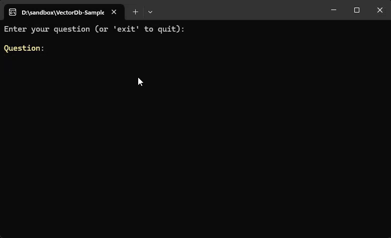
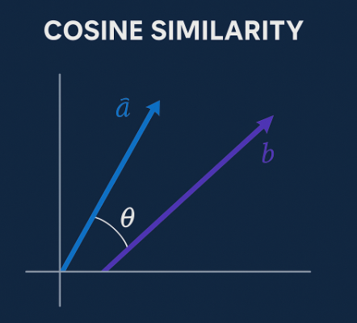
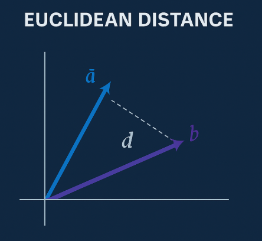
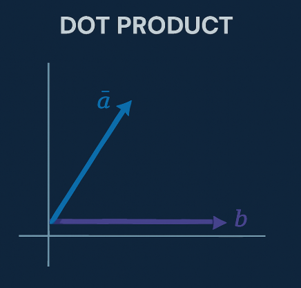

# What Is a Vector Database?
> A Practical .NET Example with PostgreSQL

Search has evolved.

We started with **simple keyword search**, improved it with **full-text search**, and are now entering the era of **semantic search** powered by **vectors**.

But here’s the reality: most software systems today are still stuck somewhere between keyword and full-text.

In this post, we’ll walk through:

- Keyword vs Full-Text vs Vector search  
- Why you need vector databases — even if you already use PostgreSQL full-text search  
- Similarity algorithms: **cosine**, **dot product**, **Euclidean** — with visuals  
- A full **.NET 9 RAG implementation** using PostgreSQL + `pgvector` + Ollama





## From Keyword to Meaning

### Keyword Search: Literal Matching

You search for `"user authentication"`.

What it does:  
- Looks for those **exact words** in documents  
- Often via `LIKE '%user%' AND LIKE '%authentication%'`  
- Cannot handle synonyms, paraphrasing, or natural questions

It’s brittle, dumb, and blind to context.

---

### Full-Text Search: Tokenization + Linguistic Awareness

PostgreSQL full-text search (`tsvector`, `tsquery`) improves things by introducing:

- **Tokenization**: Splits text into words  
- **Stop-word removal**: Filters common words like “the”, “is”, “and”  
- **Stemming**: Reduces words to their **base or root form**

---

#### What Are Word Stems?

A **word stem** is the **core part** of a word that conveys its essential meaning.

For example:

| Word            | Stem         |
|------------------|--------------|
| authentication   | authentic     |
| authenticating   | authentic     |
| users            | user          |
| validated        | valid         |
| validation       | valid         |

This means that a search for `"authenticate"` will also match documents containing:

- `"authentication"`  
- `"authenticating"`  
- `"authenticated"`

…because they **share the same stem**.

PostgreSQL does this using **language-specific dictionaries** (e.g., English, Turkish), making it far more effective than naive string matching.

But even full-text search has limits:

It understands *words*, but not *ideas*.

So it still can’t match `"credential check"` or `"login mechanism"` for `"user authentication"` — even though a human immediately sees the connection.

---

### That’s Why We Need Vector Search

Vector search goes beyond stems. It embeds entire sentences or paragraphs into numeric space that captures **semantics** — meaning, context, tone, and relationships.

No tokenization, no word lookup, no stemming.  
Just **meaning → numbers → proximity**.

---

## Similarity Algorithms (with Visuals)

Vectors are just points in space. To compare them, we measure **how close or aligned they are**.

### 1. Cosine Similarity (Angle-Based)

* Measures the **angle** between vectors.  
  > cos(a, b) = angle between a and b
* **Ignores magnitude** — it doesn’t care if vectors are “long” or “short”.
* Perfect for **text**, where relative direction matters more than absolute values.

  


### 2. Euclidean Distance (L2)

* Straight-line (Pythagorean) distance between two points.
* Sensitive to **magnitude** — vectors that are longer (i.e., have higher norm) appear farther away.

  > The **magnitude** of a vector is its length:
  > 
  > v = sqrt(v₁² + v₂² + ... + vₙ²)

* Think of it as the **distance from the origin**. Vectors with similar direction but different magnitude may still represent the same concept.

  


### 3. Dot Product

* Gives high values when vectors point in the same direction *and* are large.
  > same direction = high dot product

* Useful when you want to combine **direction** and **strength** (used in LLM ranking models)

  


### Summary of Distance Functions

| Metric            | Operator in pgvector | Best Use Case           |
|------------------|----------------------|--------------------------|
| Cosine similarity| `<=>`                | Text search, embeddings  |
| Euclidean (L2)   | `<->`                | Geometry, metrics        |
| Dot product      | `<#>`                | Ranking, hybrid scoring  |


## What Is a Vector Database?

A vector database:

- Stores **high-dimensional embeddings**
- Supports **similarity search**
- Often supports **metadata filtering**
- May implement **Approximate Nearest Neighbor (ANN)** techniques for performance

---

### Popular Vector Databases

| Name         | Description                                                                 |
|--------------|-----------------------------------------------------------------------------|
| **Faiss**    | High-speed ANN by Meta, great for local indexing with GPU support           |
| **Qdrant**   | Rust-based, with filtering and payload support, cloud-native or local       |
| **Weaviate** | Graph + vector hybrid search with a strong schema and type system           |
| **Milvus**   | Designed for massive-scale vector search, highly optimized                  |
| **Chroma**   | Lightweight, Python-first, often used in LLM pipelines                      |
| **Pinecone** | Fully managed SaaS with filtering, scaling, and hybrid keyword search       |

---

## Why pgvector?

The [`pgvector`](https://github.com/pgvector/pgvector) extension brings vector search capabilities directly into PostgreSQL.

Why use it?

- You're already using PostgreSQL  
- You need transactional consistency  
- You want to simplify infrastructure  
- You want to use raw SQL or EF Core alongside embeddings

It turns PostgreSQL into a hybrid data+vector engine with one simple line:

```sql
CREATE EXTENSION IF NOT EXISTS vector;
```

## Implementing Semantic Search in .NET with pgvector
We’ll build a Retrieval-Augmented Generation (RAG) flow that:

1. Embeds your documents using Ollama
2. Stores them in PostgreSQL
3. Accepts a user query
4. Embeds the query and finds relevant docs
5. Composes a final prompt to send to the LLM

### 1. PostgreSQL Setup

We will use the official `pgvector` Docker image for PostgreSQL 17.

Below is the docker-compose file. Save the file as `docker-compose.yml` to your project root.

```bash 

```yaml
version: "3.8"
services:
  postgres:
    image: pgvector/pgvector:pg17
    container_name: pgvector
    ports:
      - "54321:5432"
    environment:
      POSTGRES_USER: admin
      POSTGRES_PASSWORD: admin
      POSTGRES_DB: vectordb
    volumes:
      - pgdata:/var/lib/postgresql/data

volumes:
  pgdata:
```
The run it with

```bash
docker-compose up -d

```

Create pgvector extension in PostgreSQL. This is done by running the following SQL command in your PostgreSQL client (e.g., `psql`, DBeaver, etc.).

> **NOTE:** You will need to run this command on the `vectordb` database.


```sql
CREATE EXTENSION IF NOT EXISTS vector;

```
Then create the documents table with the following SQL command:

```sql
CREATE TABLE documents (
    id UUID PRIMARY KEY,
    content TEXT NOT NULL,
    embedding VECTOR(768),
    metadata JSONB
);

CREATE INDEX ON documents USING ivfflat (embedding vector_cosine_ops) WITH (lists = 100);

```
### 2. Embedding with Ollama

We will use `nomic-embed-text` model from [Ollama](https://ollama.com/library/nomic-embed-text) to generate embeddings. This model generates 768-dimensional vectors.


```csharp
// File: VectorSample.EmbeddingServices\OllamaEmbeddingClient.cs
public class OllamaEmbeddingClient: IDisposable
{
    

    private readonly HttpClient _http = new();
    private OllamaEmbeddingClientOptions _options;
    private string _model;
    private Uri _embedUri;

    public OllamaEmbeddingClient(OllamaEmbeddingClientOptions options)
    {

        _options = options;
        _model = _options.Model;
        var baseUri = new Uri(_options.BaseUrl);
        _embedUri = new Uri(baseUri,"api/embed");
    }


    public async Task<float[]> GetEmbeddingAsync(string text)
    {
        var request = new { model = _model, input = $"{text}" };

        var response = await _http.PostAsJsonAsync(_embedUri, request);
        var result = await response.Content.ReadFromJsonAsync<EmbeddingResponse>();

        return result?.Embeddings?.FirstOrDefault()?.ToArray() ?? throw new Exception("No embedding returned");
    }


    public void Dispose()
    {
        _http?.Dispose();
    }
}
```


### 3. Store Embedded Documents

```csharp
// File: VectorSample.Database\VectorStore.cs

public async Task StoreDocumentAsync(string content, float[] vector, IDictionary<string, string> metadata)
{

    var dataSourceBuilder = new NpgsqlDataSourceBuilder(_connStr);
    dataSourceBuilder.UseVector();
    await using var dataSource = dataSourceBuilder.Build();

    using var conn = dataSource.CreateConnection();
    try
    {
        await conn.OpenAsync();

        await using var cmd = new NpgsqlCommand("""
        INSERT INTO documents (id, content, embedding, metadata)
        VALUES (@id, @content, @embedding, @metadata)
    """, conn);

        cmd.Parameters.AddWithValue("id", Guid.NewGuid());
        cmd.Parameters.AddWithValue("content", content);
        cmd.Parameters.AddWithValue("embedding", vector);
        // Properly defined JSONB param
        cmd.Parameters.Add(new NpgsqlParameter("metadata", JsonSerializer.Serialize(metadata))
        {
            NpgsqlDbType = NpgsqlDbType.Jsonb
        });

        await cmd.ExecuteNonQueryAsync();
    }
    finally
    {
        await conn.CloseAsync();
    }
}
```

### 4. Search with Cosine Similarity
  
```csharp
// File: VectorSample.Database\VectorStore.cs

public async Task<List<string>> SearchAsync(float[] queryVector,int topK = 5)
{

    var dataSourceBuilder = new NpgsqlDataSourceBuilder(_connStr);
    dataSourceBuilder.UseVector();
    await using var dataSource = dataSourceBuilder.Build();
    

    var vector = new Pgvector.Vector(queryVector);
    using var conn = dataSource.CreateConnection();

    try
    {
        await conn.OpenAsync();
      
        await using var cmd = new NpgsqlCommand("""
            SELECT 
                content
            FROM documents
            ORDER BY embedding <=> @embedding
            LIMIT @topK
        """, conn);

        cmd.Parameters.AddWithValue("embedding", vector);
        cmd.Parameters.AddWithValue("topK", topK);


        var results = new List<string>();
        var reader = await cmd.ExecuteReaderAsync();
        while (await reader.ReadAsync())
            results.Add(reader.GetString(0));

        return results;
    }
    finally
    {
        await conn.CloseAsync();
    }
}
```

### 5. RAG Prompt Composition

```csharp
// File: VectorDb-Sample\VectorSample.RagCli\Program.cs
internal class Program
{

    private static string _connectionString = "Host=localhost;Port=54321;Username=admin;Password=admin;Database=vectordb";
    private static string _chatModel = "phi4";
    private static string _embedModel = "nomic-embed-text";

    private static string _ollamaUrl = "http://localhost:11434";


    static async Task Main(string[] args)
    {
        
        using var vectorStore = new VectorStore(new(_connectionString));
        using var chatClient = new OllamaChatClient(new(_ollamaUrl, _chatModel));
        using var embeddingClient = new OllamaEmbeddingClient(new(_ollamaUrl, _embedModel));

        Console.WriteLine("Enter your question (or 'exit' to quit):");


        while (true)
        {

            var firstChunkArrived = false;
            var spinnerFinished = false;
            Console.WriteLine();
            var question = AnsiConsole.Prompt(
                new TextPrompt<string>("[bold yellow]Question[/]:").AllowEmpty());

            if (string.Equals(question, "exit", StringComparison.OrdinalIgnoreCase))
                break;

            List<string> topDocs = new();

            StatusContext statusContext = null!;

            var _ = AnsiConsole.Status()
                .Spinner(Spinner.Known.Star)
                .StartAsync("Thinking...", async ctx => {

                    statusContext = ctx;
                

                    while (!firstChunkArrived)
                    {
                        await Task.Delay(100);
                    }

                    ctx.Status("Done Thinking");
                    ctx.Refresh();
                    spinnerFinished = true;
                    return;
                });


            statusContext.Status("Generating embedding...");
            statusContext.Refresh();
            var questionVector = await embeddingClient.GetEmbeddingAsync(question);

            statusContext.Status("Searching vector store...");
            statusContext.Refresh();

            topDocs = await vectorStore.SearchAsync(questionVector, 5);
            statusContext.Status("Thinking...");
            statusContext.Refresh();

            var prompt = $"""
                You are a helpful assistant. Use the following documents to answer the question.

                Documents:
                {string.Join("\n---\n", topDocs)}

                Question: {question}
                Answer:
                """;


            try
            {
                await foreach (var response in chatClient.ChatAsync(question, systemPrompt: prompt))
                {
                    if (!firstChunkArrived)
                    {
                        AnsiConsole.MarkupLine("[bold blue]Response:[/]");
                        firstChunkArrived = true;
                    }

                    while (!spinnerFinished)
                    {
                        await Task.Delay(100);
                    }
                    Console.Write($"{response}");
                }
            }
            catch(Exception ex)
            {
                firstChunkArrived = true;
                while (!spinnerFinished)
                {
                    await Task.Delay(100);
                }
                AnsiConsole.MarkupLine($"[red]Error:{Markup.Escape(ex.Message)}[/]");
            }
            Console.WriteLine();
        }
    }
}
```
## When to Use What?

| Technique        | Good For                                    |
|------------------|---------------------------------------------|
| Keyword search   | Simple literal matching, filtering by ID    |
| Full-text search | Exact phrasing + language stem detection    |
| Vector search    | Semantic intent, LLMs, paraphrased content  |
| Hybrid (fts+vec) | Best of both worlds in enterprise scenarios |

## Real-World Scenarios

* Search support tickets by meaning: “SSL handshake error” → matches “TLS cert failure”

* Legal clause discovery: “Termination without notice” → matches “Immediate cancellation clause”

* Developer tools: “Thread-safe list” → finds ConcurrentQueue docs

* IIoT logs: “Spindle vibration high” → matches “Abnormal RPM readings”


## Final Thoughts
Vector databases give us a semantic lens into unstructured data.

**PostgreSQL + pgvector** is all you need to build powerful semantic apps — in a single stack, with transactional safety, and full .NET integration.

You're not locked into Pinecone, Chroma, or Faiss.
You can do it all — right inside your existing PostgreSQL instance.

## References

* [Ollama API Documentation](https://github.com/ollama/ollama/blob/main/docs/api.md)
* [pgvector docker compose](https://github.com/pgvector/pgvector?tab=readme-ov-file#docker)

